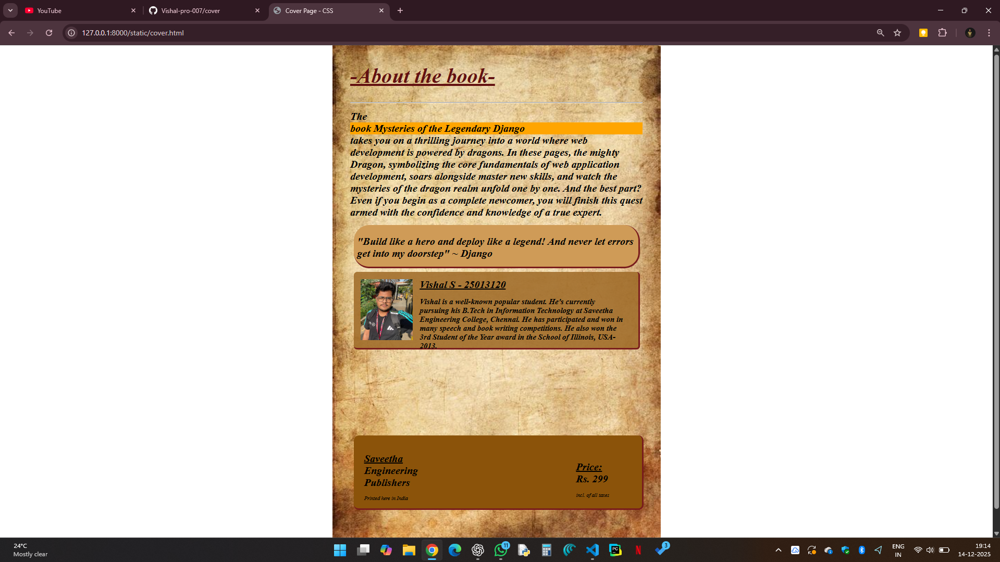

# Ex.05 Book Cover Page Design
## Date: 14.12.2025

## AIM:
To design a book back cover page using HTML and CSS.

## DESIGN STEPS:

### Step 1:
Create a Django Admin project.

### Step 2:
Create an app in the Django interface.

### Step 3:
Create a folder named 'static' in the app folder.

### Step 4:
Create a new HTML file in the static folder.

### Step 5:
Write the HTML code with relevant CSS properties.

### Step 6:
Choose the appropriate style and color scheme.

### Step 7:
Insert the images in their appropriate places.

### Step 8:
Publish the website in the LocalHost.

## PROGRAM:

1) cover.html
```
<html>
<head>
    <title>Cover Page - CSS</title>
    <link rel="stylesheet" href="style.css">
</head>
<body>
    <div class="container">
        <div class="Heading">
            <h1><u><b>-About the book-</b></u></h1>
            <hr>
        </div>
        <div class="info">
            <h1>The <span>book Mysteries of the Legendary Django</span> takes you on a thrilling journey
                into a world where web development is powered by dragons. In these pages, the mighty 
                Dragon, symbolizing the core fundamentals of web application development, soars alongside
                master new skills, and watch the mysteries of the dragon realm unfold one by one.
                And the best part? Even if you begin as a complete newcomer, you will finish this quest
                armed with the confidence and knowledge of a true expert.</h1>
        </div>
        <div class="box1">
            <h1>
                "Build like a hero and deploy like a legend!
                And never let errors get into my doorstep"
                ~ Django
            </h1>
        </div>
        <div class="box2"></div>
        <div class="text">
            <h1><u>Vishal S - 25013120</u></h1>
            <h2>
                Vishal is a well-known popular student. He's currently pursuing his B.Tech in
                Information Technology at Saveetha Engineering College, Chennai. He has participated
                and won in many speech and book writing competitions. He also won the 3rd Student
                of the Year award in the School of Illinois, USA-2013.
            </h2>
        </div>
        <div class="box3">
            <h1 class="publisher">
                <span class="saveetha"><u>Saveetha</u></span>
                <span class="saveetha">Engineering</span>
                <span class="saveetha">Publishers</span>
            </h1>
            <p>Printed here in India</p>
        </div>
        <div class="text2">
            <h1><u><span class="price">Price:</span></u> Rs. 299</h1>
            <p>incl. of all taxes</p>
        </div>
        </div>
    </div>
</body>
</html>

```
2) style.css
```
body
{
    background: url('Cover.jpg') center / contain no-repeat fixed;
}

.Heading
{
    font-style: bold;
    font-size: 30px;
    color: rgb(99, 17, 17);
    
}

.container
{
    padding-left: 1000px;
    padding-right: 1000px;
    padding-top: 5px;
    font-style: italic;
    font-size: 15px;
}
span
{
    background-color: orange;
}

.box1
{
    width:800px;
    height: 100px;
    border-right: inset 5px rgb(121, 28, 28);
    border-bottom: inset 5px rgb(121, 28, 28);
    background-color: rgb(207, 155, 87);
    margin: 10px;
    padding: 10px;
    border-radius: 45px;

}

.box2
{
    width:800px;
    height: 200px;
    border-right: inset 5px rgb(121, 28, 28);
    border-bottom: inset 5px rgb(121, 28, 28);
    background-color: rgba(160, 108, 41, 0.884);
    background-image: url('Vishall.jpg');
    background-repeat: no-repeat;
    background-size: 150px;
    background-position: 20px center;
    margin: 10px;
    padding: 10px;
    border-radius: 10px;
}

.text
{
    position: relative;
    left: 200px;
    bottom: 225px;
    width: 590px;
    height: px;
}

.box3
{
    width:770px;
    height: 150px;
    border-right: inset 5px rgb(121, 28, 28);
    border-bottom: inset 5px rgb(121, 28, 28);
    background-color: rgb(139, 83, 10);
    margin: 10px;
    padding: 30px;
    border-radius: 15px;
}

.text2
{
    position: relative;
    left: 650px;
    bottom: 160px;
    width: 760px;
}

.line
{
    position: relative;
    left: 430px;
    bottom: 405px;
    width: 760px;
    height: px;
}

.saveetha
{ 
    background: none;
}

h1 span 
{
    display: block;
}

.price
{
    background: none;
}
```

## OUTPUT:


## RESULT:
The program for designing book back cover page using HTML and CSS is completed successfully.
